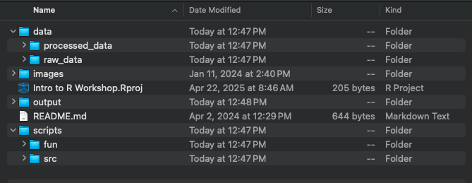
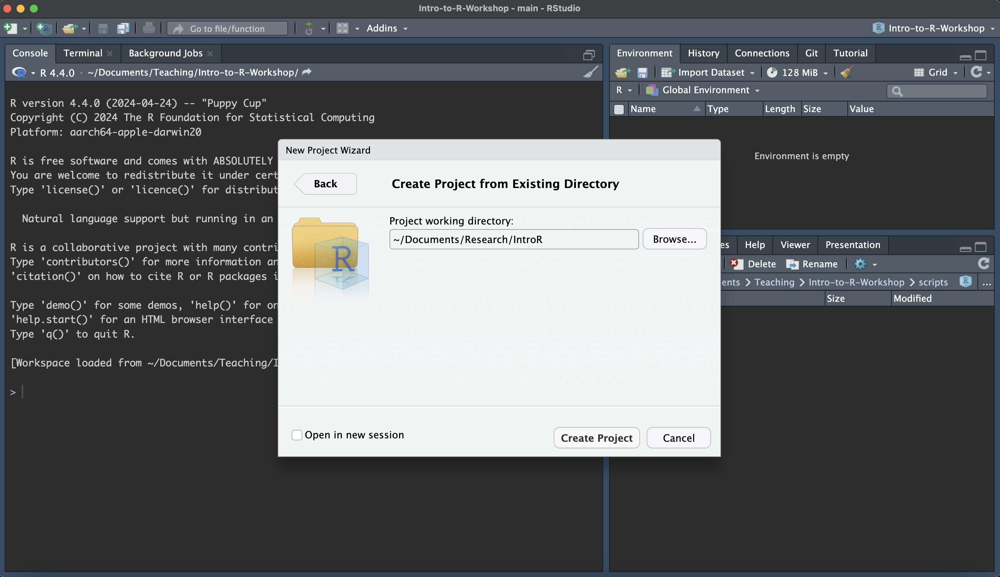

# Intro to R and R-Studio {#intro}

## What is R?
R is both the name of the programming language and the software used for data storage and manipulation. 

RStudio is the Integrated Development Environment (IDE) for the R programming language that
makes writing, running, and organizing R code more efficient. RStudio provides a centralized interface where you can manage your code, working directory, data, output, and environment all in one place. On my MacBook, I keep R and RStudio in the Applications folder, and on Windows, I store them on the C drive. You will need to download [R](https://cran.r-project.org) before downloading [RStudio](https://posit.co/downloads/). 

## Directory Structure {#directory-structure}
Before creating an RStudio Project, it's important to think about how your project is structured, as this will shape your directory (i.e. folder) organization. I typically create a separate folder for each analysis, and within each, I include subfolders for data, output, and scripts. Other folders might include figures, results, and documents. You may want to consider housing two projects in the same directory if they utilize the same data. All files need to be readable by the computer and should not contain white spaces, punctuation, or special characters. I generally follow the same naming conventions for my files (e.g., camelCase, snake_case, kebab-case, PascalCase).



After setting up your directory structure, the next step is to create an RStudio Project
in R Studio.

***

**`EXERCISE 1: CREATING A WORKING DIRECTORY`**

1. Create a new working directory named `IntroR`. You can put this folder in whichever location makes sense for you on your computer.
2. Create subfolders named `data`, `output`, and `scripts`

***

## R Studio

First let's go over the basics of RStudio. When you first open RStudio, you will be greeted by three panels:


1) **The Interactive R Console (entire left)**
* R scripts appear in the top left. This is where you write your code. When you execute this code, it appears in the Console (bottom left). You can run code from the console, but it will be erased once you close R (unless you save your R history). It's best to write a saveable script in the code editor where you can send lines of code to the console to be executed.
2) **Environment/History (tabbed in upper right)**
* Environment: collection of objects (i.e. variables, data frames, functions, etc.) that we define during our R session
* History: this contains every line of code executed during the session
3) **Files/Plots/Packages/Help/Viewer (tabbed in lower right)**
  + **Files** shows all the files in your working directory. A **working directory** is essentially the default folder that R is reading data from/putting output into. We will go through setting the working directory below. You can also create, delete, and rename files and folders from this tab.
  + **Plots** displays figures that you generate
  + **Packages** displays any packages you have downloaded and installed in R. If there is a check mark next to a package, it means you've loaded it into your current R session
  + **Help** will show you a description of functions. To get a function description, simply run `?` followed by the function name. For example, `?setwd()` will show me the documentation for the `setwd()` function.
  + **Viewer** displays interactive or web-based content
  + **Presentation** displays slide-style documents created using R Markdown

## RStudio Projects
Now that we understand the basics of RStudio, let's create an RStudio Project that will live in the directory folder of the analysis. RStudio Projects are a self-contained, portable work space where you can have your data, code, and output all in one place. RStudio Projects are also great to use for reproducibility because they are self-contained and easy to share with collaborators. This means you can compress the entire RStudio Project into a ZIP file and share it with a collaborator, who should then be able to run your code and reproduce the same results. Let's go through how to set up an RStudio Project.

**Steps for Making an RProject**



1) Open the `File` menu from the upper left.
2) Select `Existing Directory` since we have already set up our project's directory
3) Navigate to the directory folder
4) Select `Create Project`

Each time you open this RStudio project, the working directory will automatically be set to the `IntroR` folder. The working directory is automatically set to the folder where your RStudio Project is stored. RStudio Projects remove the need to manually set the working directory. 

For example, if my RStudio Project is located in <em>C:/Teaching/IntroR/</em>, my working directory is also located <em>C:/Teaching/IntroR/</em>. 

***

**`EXERCISE 2: CREATE AN RSTUDIO PROJECT`**

1. Create an RStudio PRoject using the instructions above.

***

## Using Comments

Use the `#` to tell R you are making a comment. Comments are used to explain code and allow someone unfamiliar with your code to follow more easily. Commenting can also be used to prevent R from running specific lines of code since R ignores anything that follows the `#` mark.

```{r}
# 567*5 tells R that 567*5 is a comment, and so R knows not to execute this line of code.
```

Sometimes you want to comment out large sections of code, and this can be done using `control + shift + c` on windows or `command + shift + c` on a macbook.

***

**`EXERCISE 3: USING COMMENTS`**

1. Create a new script (File > New File > R Script)
2. In the first line, type `# Intro R`
3. On line 2, type ` 1 + 1`
4. select `Run` in the upper right corner of the console

***
