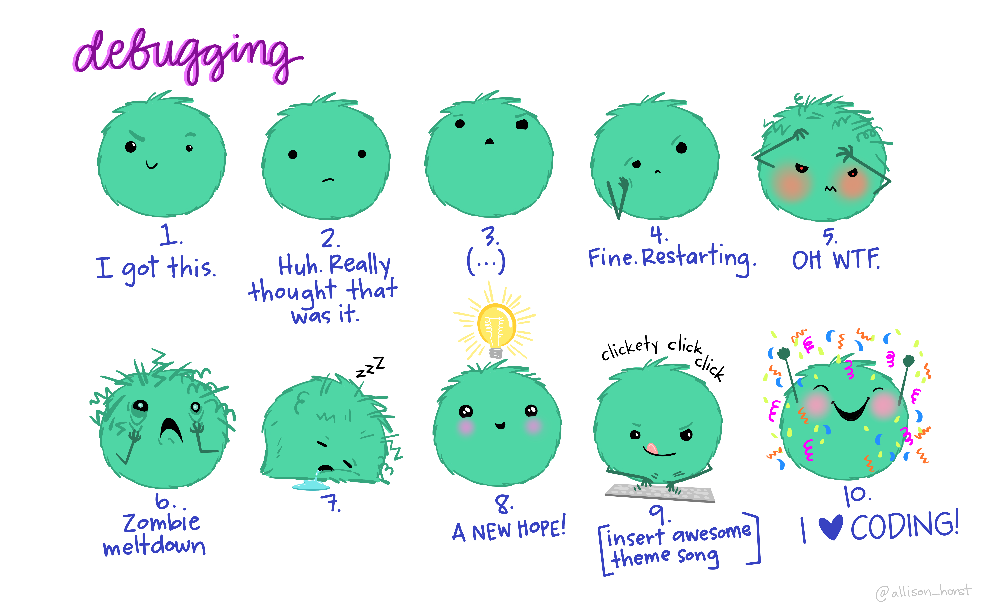

# Debugging Code {#debugging}

  
  
<em>Artwork by Allison Horst</em>

Even when you know R well, you will inevitably find yourself in a situation where you don't understand a package, have an error, don't know the right function to use, or need ideas of how to write the correct code.

## Check Your Parenthesis! 

## Coercian Problems

## Do you need to label your arguments in your function?

## Use the help function in RStudio!

## ...

**USE GOOGLE!**
Using a google search will most often give you results that can answer your questions. Most packages have a documentation page that you can google if you don't understand how it works too. For example, I could google, "how do I use the seq function in R to return a sequence of numbers by 0.5?" It's important to note that you are using the programming language R, and the objective that you want to take.

**Never be afraid to google if you run into trouble! The website [stackoverflow](https://stackoverflow.com) is your friend.**

ChatGPT can be very useful, but it can sometimes be correct. Overuse of AI can also prevent you from developing your coding skills.
