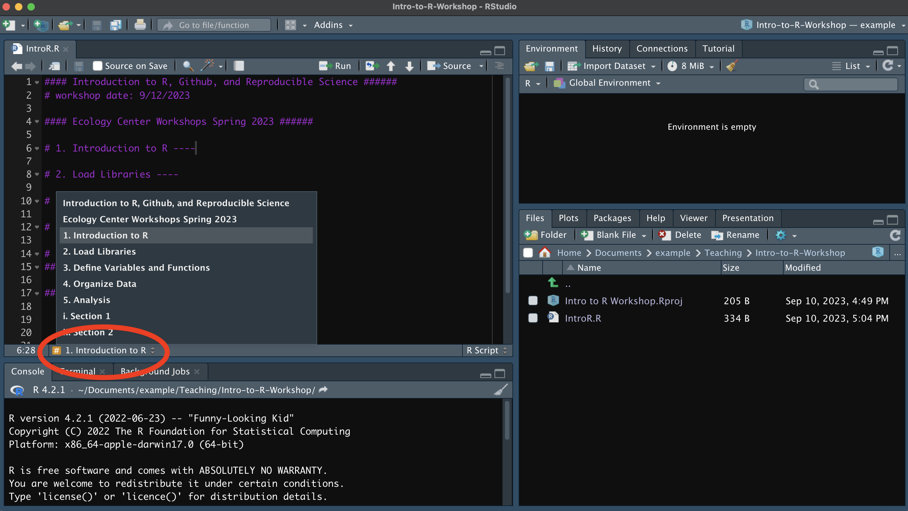

# Making Readable R Code {#readable-r}

## Outlining R Scripts
R scripts can get long, and it can get a bit unwieldy to navigate between different sections of your script. One neat way to outline your script is by using comment headers as bookmarks. This can be accomplished by either putting  `----` or  `####` after a commented line.

`# 1. Section ----`  
`## a. Subsection ####`  
`### i. Sub-subsection ----`

## Pseudocoding

Pseudocoding is basically a way to map out your code by writing down the logic in plain English. It helps you figure out what you're trying to do, organize your ideas, and spot potential issues before you actually start coding. It's like sketching a rough draft before creating the final version. Pseudo coding can also be used to identify problematic code.

To write pseudocode:

1. Define the problem: Understand what you want to solve.
2. Outline the steps: Break down the problem into logical, sequential steps.
3. Use simple language: Write instructions in a clear and understandable format, avoiding technical jargon.
4. Focus on logic: Focus on the flow of data, control structures (loops, conditionals), and key operations.

## Making Readable R Code

1) Start each script with a brief description of what it does, who wrote it, and the last date it was edited.
2) Then load all required packages, define functions, and set any variables used consistently throughout your script.
* Example: If you are going to be exporting many plots during the course of your script,  you could set a variable to the output folder. Setting variables allows you to not have repeat code.
`output_plots <- "output/plots/"`
* You can source functions from a separate script using `source()`. Remember what working directory you are in when sourcing a script.
4) Use comments to mark off sections of code.
5) Outline your script
6) Name and style code consistently. Spacing can make code more readable, but it's really up to personal preference.
7) Break code into small, discrete pieces. 
9) Think about the best way to organize your directory given your objectives. I often have sub folders for data, output, and docs.
10) Start with a clean environment instead of saving the work space.
11) Consider using version control (i.e. Github).
